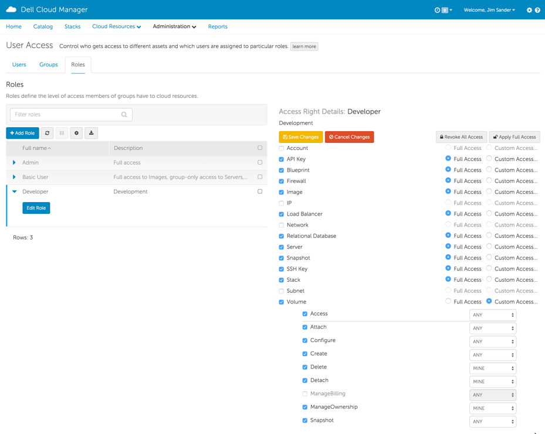
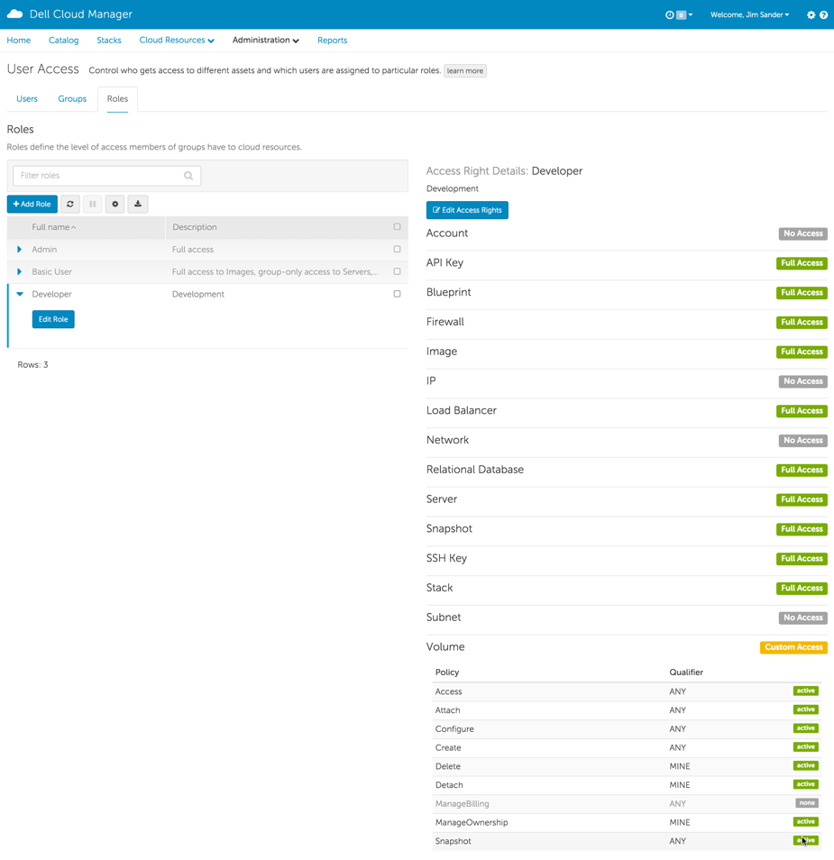

.. raw:: latex
  
      \newpage

.. _access_rights:

Access Rights
-------------

**Access Rights** define what resources can be accessed and what actions can be performed against those resources.  An access right consists of these 3 items:

Resource type
~~~~~~~~~~~~~

 The resource type specifies the resources to be controlled (e.g. servers, machine images, volumes, etc.)

 Refer to :ref:`Resource Types <access_rights_resource_types>` for the list of supported resource types and supported actions.

Action
~~~~~~

 The **Action**\ s determine what "actions" the Access Right will allow for the **Resource** type.  All actions can be allowed or specific actions can be allowed. The allowable actions differ depending upon the **Resource** type.

 Refer to :ref:`Resource Types <access_rights_resource_types>` for the list of supported actions by resource type.

Qualifier
~~~~~~~~~

 The **Qualifier** determines the "scope" of the resources.

 Refer to :ref:`Qualifiers <access_rights_qualifiers>` for the list of the supported qualifiers.

.. toctree::
   :maxdepth: 3
   :hidden:
   :titlesonly:

   resource_types
   qualifiers

Setting Access Rights
---------------------

Access Rights are set from the *Roles* tab of the *User Access* page accessed from the Administration pulldown 
*  (i.e. Administration->User Access->Roles )

In the figure below:

*  Edited access rights for *Developer* Role
*  Deselected some *Resource Types* for the role to prevent access to them ( Account, IP, Network and Subnet )
*  Customized access for the *Volume* Resource type
  *  Set *Qualifer* to *Mine* for *Actions* ( Delete, Detach and ManageOwnership ) which restricts these actions to resources belonging to the User associated
    with this role
  *  Unchecked box of *Action* for ManageBilling which disables the availability of the action for this role

The figure below shows the resulting *Access Right* settings after saving changes:

