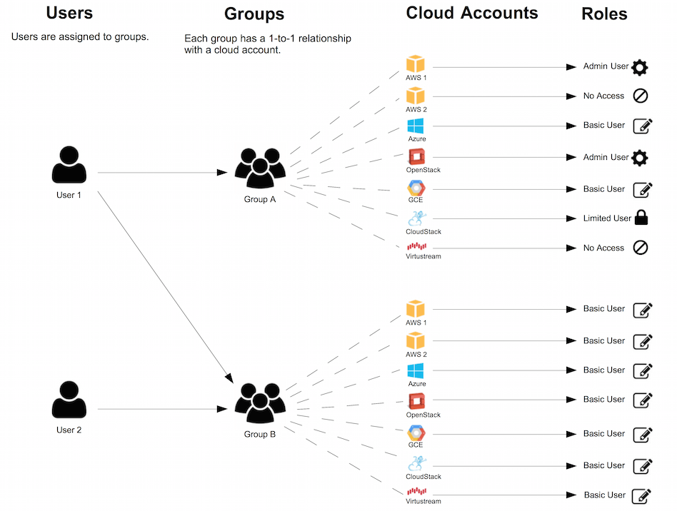
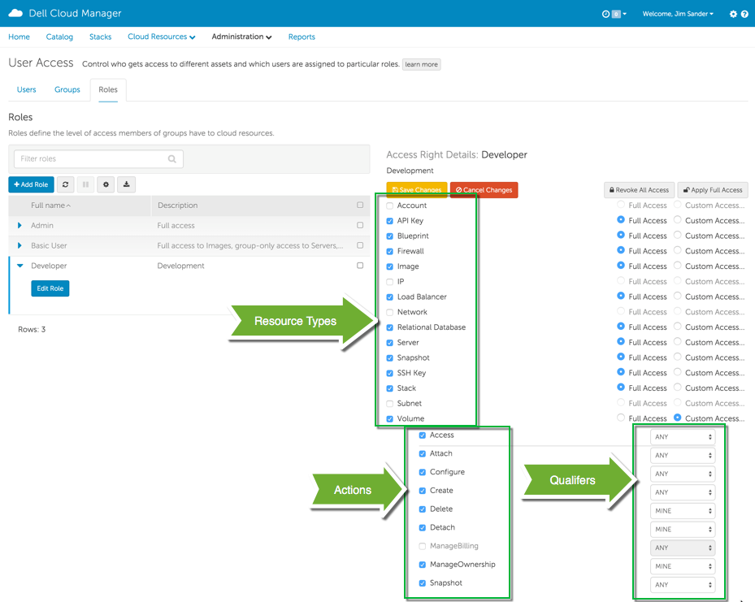

.. raw:: latex
  
      \newpage

.. _conceptual:

Conceptual
----------

Relationship between users, groups, roles and access rights

.. raw:: html

   

 
|
Components of Access Rights
***************************

Access Rights are comprised of three components, and will be covered in the following pages

*  Resource Types
*  Actions
*  Qualifers

 
